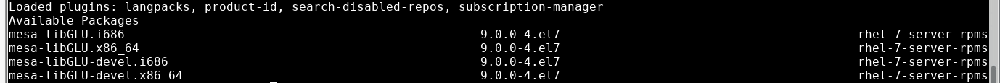

# dev_GaussRH7
Gauss update for RHEL 7.x from v15 to v20

#### Add for XWindows 
Use:
`$sudo yum groupinstall "Server with GUI"` 

Instead of:
`$sudo yum groupinstall "X Window System"` 

Add EPEL:
`$sudo yum install -y https://dl.fedoraproject.org/pub/epel/epel-release-latest-7.noarch.rpm` 

Install XFCE4:
`$sudo yum groupinstall -y "Xfce"` 

Check Available Display Managers:
`$cd /usr/share/xsessions` 

#### Add Library Path
Testing for verification: 
1: 
`lib <path_to_lib> -addpath` 

2: 
Under library tool -> Under Paths -> Right-Mouse-Button -> Add Files  

#### Error - Qt: XKEYBOARD extension not present on the X Server
FIX:
Add file (i.e. xkeyboard.sh to /etc/profile.d) with following line: 
`export XKB_DEFAULT_RULES=base` 

#### Error - error while loading shared libraries: libGLU.so1: no such file or directory
`$sud yum list install *libGLU*` 

FIX:
`$sudo yum install mesa-libGLU*` 

##### Library Source & Example
1) Download carrionlib.zip from https://github.com/aptech/gauss-carrion-library/releases
2) Select Tools -> Install Applications from main Gauss Menu
  2a) Make sure /usr/local/gauss20/pkgs is created and writable
3) Follow installer prompt
4) Before using functions created by carrionlib, need to load the newly created carrionlib library:
  4a) Navigate to Library Tool Windows and click on small wrench located next to the carrionlib library. Select load library
  4b) Enter library carrionlib in Porgram Input/Output Window
  4c) Put the line library carrionlib; at the beginning of your program files

##### Add Library Path to `/home/<org>/<username>/gauss20/gauss.cfg`
`extra_lib_path = /<path_lo_libraries>/` 

Right-mouse-button click on Library Tool to load library 
